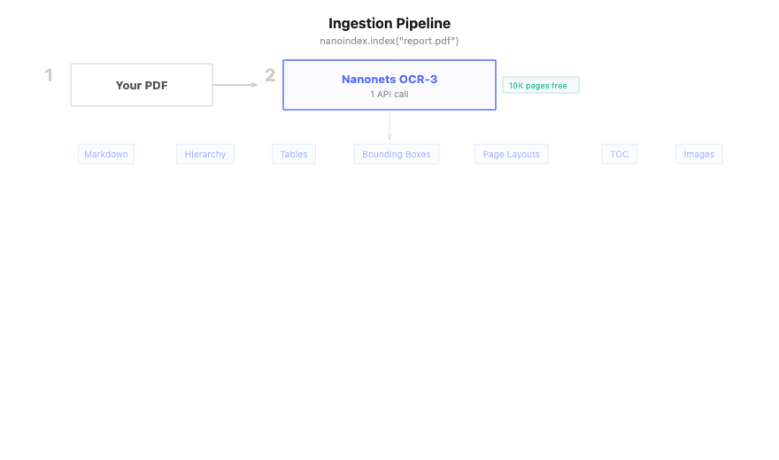
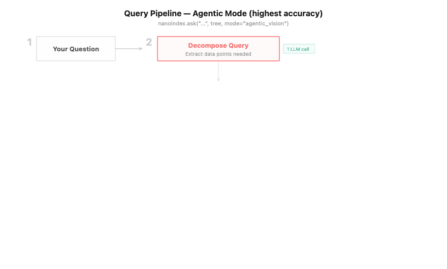
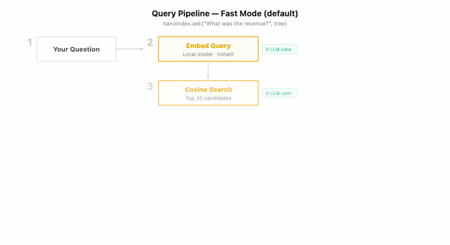
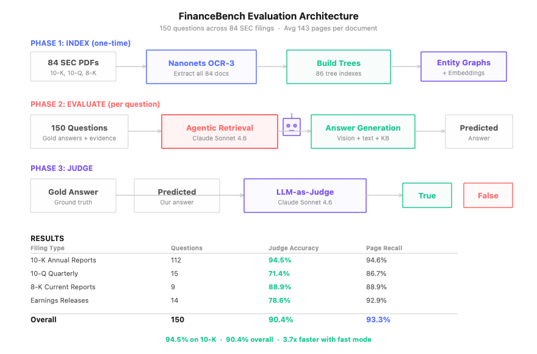

<div align="center">


# NanoIndex

**Open-source GraphRAG that actually works on real documents.**
**Karpathy-inspired knowledge bases. Self-correcting extraction. Cited answers down to the pixel.**

<p>
  <a href="https://github.com/nanonets/nanoindex"></a>
  <a href="https://nanonets.com/research/nanonets-ocr-3"></a>
  <a href="https://www.apache.org/licenses/LICENSE-2.0"></a>
</p>

<p>
  <a href="https://docstrange.nanonets.com/app"></a>
  <a href="https://colab.research.google.com/github/NanoNets/nanoindex/blob/main/examples/nanoindex_quickstart.ipynb"></a>
</p>

| Benchmark | Documents | Avg Pages | Accuracy |
|---|---|---|---|
| FinanceBench (SEC 10-K filings) | 84 | 143 | **94.5%** |
| DocBench Legal (court filings, legislation) | 51 | 54 | **96.0%** |

</div>

Most RAG systems throw away the thing that makes documents useful: their structure. They chop PDFs into chunks, embed them, and hope the right chunk floats to the top. It works for simple lookups. It fails for anything that requires actually understanding the document.

NanoIndex does what a careful reader would do. It reads the headings. It sees the table of contents. It understands that section 3.2 is part of section 3. Then it builds two things: a tree (the document's hierarchy) and a knowledge graph (entities, relationships, communities). When you ask a question, the LLM navigates the tree to find the right section and cites the exact page and coordinates. When you ask a broad question like "what are the main themes?", it reasons across community summaries.

Extraction is self-correcting. Think insurance loss runs: document says "Total Claims: 35" but extraction found 38? NanoIndex spots the 3 duplicates, removes them, and validates again until the numbers match.

The knowledge base is inspired by [Karpathy's LLM wiki approach](https://gist.github.com/karpathy/442a6bf555914893e9891c11519de94f): documents compile into interlinked markdown pages that grow smarter with every query. Open the folder in Obsidian and browse it like a wiki.

Built on [Nanonets OCR-3](https://nanonets.com/research/nanonets-ocr-3). Fully open source.

---

## What Makes NanoIndex Different

| | Vector RAG | Microsoft Graph RAG | PageIndex | NanoIndex |
|---|---|---|---|---|
| **Indexing** | Chunk + embed | LLM extracts from chunks | LLM builds tree from pages | OCR-3 extracts structure + entities |
| **Cost per doc** | Low (embedding) | High (LLM per chunk) | High (LLM per page) | Low (1 API call + free local NER) |
| **Structure** | Lost | Lost | Preserved (tree) | Preserved (tree + graph) |
| **Knowledge graph** | None | Yes (LLM-only) | None | Yes (GLiNER + spaCy + optional LLM) |
| **Entity resolution** | N/A | Basic | None | Fuzzy (suffix, substring, Levenshtein) |
| **Communities** | None | Leiden | None | Louvain + auto summaries |
| **Global queries** | Cannot answer | Map-reduce | Cannot answer | Map-reduce communities |
| **Tables** | Poor | Not supported | Not supported | Natively extracted |
| **Vision** | No | No | No | Page images to LLM |
| **Citations** | Chunk-level | None | Page-level | Pixel-level (bounding boxes) |
| **Knowledge Base** | None | None | None | Obsidian wiki with [[backlinks]] |
| **Self-correction** | None | None | None | Validates against doc totals |
| **Open source** | Varies | Yes | Yes | Yes |

---

## Quick Start

```bash
pip install nanoindex
```

Or with [uv](https://docs.astral.sh/uv/) (recommended):

```bash
uv add nanoindex
```

```bash
export NANONETS_API_KEY=your_key    # Get free at docstrange.nanonets.com/app (10K pages free)
export ANTHROPIC_API_KEY=your_key   # Or OPENAI_API_KEY, GOOGLE_API_KEY, GROQ_API_KEY
```

```python
from nanoindex import NanoIndex

ni = NanoIndex()
tree = ni.index("report.pdf")
answer = ni.ask("What was the revenue?", tree)
print(answer.content)
```

3 lines. Keys auto-detected. LLM auto-selected.

---

## Everything It Can Do

### Document Q&A with cited answers

```python
answer = ni.ask("What was Q3 gross margin?", tree)
print(answer.content)     # "Gross margin was 42.3% in Q3..."
print(answer.citations)   # [Citation(title="Income Statement", pages=[45, 46])]
```

### Knowledge graph (built automatically)

Every document gets an entity graph with zero extra API calls:

```python
graph = ni.get_graph(tree)
print(f"{len(graph.entities)} entities, {len(graph.relationships)} relationships")

for e in graph.entities[:5]:
    print(f"  [{e.entity_type}] {e.name}")
for r in graph.relationships[:5]:
    print(f"  {r.source} --{r.keywords}--> {r.target}")
```

Entity extraction pipeline:
1. **GLiNER zero-shot NER** with domain-adaptive labels (financial, legal, medical, insurance)
2. **spaCy dependency parsing** for subject-verb-object relationships
3. **Entity resolution** merges duplicates (fuzzy matching, suffix stripping, Levenshtein)
4. **Community detection** groups related entities (Louvain algorithm)
5. **LLM enhancement** adds domain-specific entities (optional, when reasoning LLM available)

### Global queries (community-based)

Answer questions about the entire document, not just specific facts:

```python
answer = ni.ask("What are the main themes in this document?", tree, mode="global")
```

Uses map-reduce across community summaries.

### Structured data extraction (self-correcting)

Extract tables and forms with self-correcting validation:

```python
result = ni.extract("invoice.pdf")
print(result.fields)      # {'vendor': 'Acme', 'total': '$15,260'}

result = ni.extract("claims.pdf")
print(result.rows)         # [{'claim_no': 'WC-001', 'paid': 15000}, ...]
print(result.validation)   # ValidationResult(passed=True, row_count_match=True)
result.to_csv("output.csv")
```

Self-correcting loop: extract, validate against document totals, fix mismatches, repeat.

### Knowledge Base (wiki-based)

Documents compile into an Obsidian-compatible wiki that grows with every query:

```python
from nanoindex import KnowledgeBase

kb = KnowledgeBase("./my-research")
kb.add("report1.pdf")
kb.add("report2.pdf")
answer = kb.ask("How do these compare?")  # answer filed back into wiki
kb.lint()                                  # find contradictions, stale data
```

Open `my-research/` in Obsidian. Browse concept pages with `[[backlinks]]`, entity graphs, activity logs.

### Bounding box citations

Every answer includes pixel-level coordinates:

```python
for citation in answer.citations:
    for bb in citation.bounding_boxes:
        print(f"Page {bb.page}: ({bb.x:.2f}, {bb.y:.2f}) text: {bb.text}")
```

### Pick your LLM

```python
ni = NanoIndex(llm="anthropic:claude-sonnet-4-6")
ni = NanoIndex(llm="openai:gpt-5.4")
ni = NanoIndex(llm="gemini:gemini-2.5-flash")
ni = NanoIndex(llm="groq:llama-3.3-70b-versatile")
ni = NanoIndex(llm="ollama:llama3")        # local, no API key
```

### CLI

```bash
nanoindex index report.pdf -o tree.json
nanoindex ask report.pdf "What was the revenue?"
nanoindex viz tree.json
nanoindex kb create ./my-wiki
nanoindex kb add report.pdf --wiki ./my-wiki
nanoindex kb ask "What are the key findings?" --wiki ./my-wiki
```

### Open-source mode (no API key for parsing)

```python
ni = NanoIndex(parser="pymupdf")
tree = ni.index("report.pdf")  # fully local, no API calls
```

---

## Query Modes

| Mode | How it works | Best for |
|---|---|---|
| `agentic_vision` (default) | LLM navigates full tree + reads page images | Highest accuracy |
| `agentic` | Same without images | Text-heavy docs |
| `agentic_graph` | Graph seeds initial nodes, agent reasons + expands | Best accuracy/cost balance |
| `agentic_graph_vision` | Same + page images | Graph precision + visual reasoning |
| `fast` | Graph entity lookup, LLM sees ~20 nodes | Cheapest, fastest |
| `fast_vision` | Same + page images | Charts and figures |
| `global` | Map-reduce across community summaries | "What are the main themes?" |

---

## How It Works

### Indexing

<p align="center">
  
</p>

### Querying

<p align="center">
  
</p>

<p align="center">
  
</p>

---

## Benchmarks

| Benchmark | Documents | Avg Pages | Accuracy |
|---|---|---|---|
| FinanceBench (SEC 10-K filings) | 84 | 143 | **94.5%** |
| DocBench Legal (court filings, legislation) | 51 | 54 | **96.0%** |

Evidence page retrieval: **93.3%**

<p align="center">
  
</p>

---

## Development

```bash
git clone https://github.com/nanonets/nanoindex.git
cd nanoindex

# With uv (recommended)
uv sync --extra dev
uv run pytest

# Or with pip
pip install -e ".[dev]"
pytest
```

For entity extraction with GLiNER2 (zero-shot NER, domain-adaptive labels):

```bash
uv sync --extra gliner    # or: pip install nanoindex[gliner]
```

GLiNER2 auto-detects GPU (CUDA) and uses batch inference for speed. On GPU: ~2 min per 150-page document. On CPU: ~8 min.

---

## License

Apache 2.0 — see [LICENSE](LICENSE).
