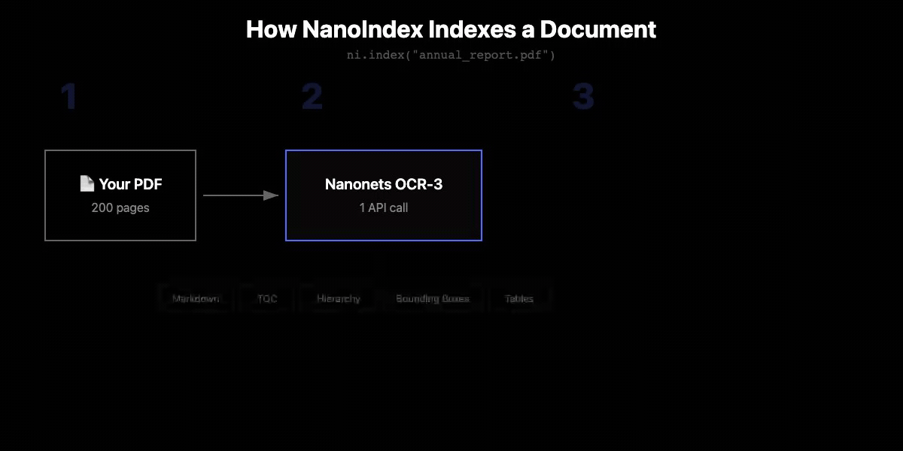

<div align="center">


# NanoIndex

**Open-source Agentic-RAG harness for long documents.**
**Self-validating trees. Entity graphs. Cited answers down to the pixel.**

<p>
  <a href="https://pypi.org/project/nanoindex/"></a>
  <a href="https://github.com/nanonets/nanoindex"></a>
  <a href="https://nanonets.com/research/nanonets-ocr-3"></a>
  <a href="https://www.apache.org/licenses/LICENSE-2.0"></a>
</p>

<p>
  <a href="https://docstrange.nanonets.com/app"></a>
  <a href="https://colab.research.google.com/github/NanoNets/nanoindex/blob/main/examples/nanoindex_quickstart.ipynb"></a>
</p>

| Benchmark | Documents | Avg Pages | Accuracy |
|---|---|---|---|
| FinanceBench (SEC 10-K filings) | 84 | 143 | **94.5%** |
| DocBench Legal (court filings, legislation) | 51 | 54 | **96.0%** |

<p align="center">
  
</p>

</div>

---

## The problem

You have a 200-page annual report. You ask: "Which business segment is growing the fastest?"

To answer that, you need to find the segment breakdown, figure out which segments exist, pull revenue for each one across two years, compute the growth rates, and compare. The data is spread across the MD&A section, the segment footnote, and the income statement. Three different sections, none of which contain the word "fastest."

A chunk-and-embed retriever won't find all three. A decomposer agent can't split this question upfront because you don't know what the segments are until you read the document. You have to explore first, then compute.

Same problem across industries:

- **Finance.** Chunking splits a balance sheet table mid-row. The system finds current assets but misses current liabilities. Half a table, wrong answer.
- **Legal.** A liability cap in Section 8.3 references definitions in Section 1.1 and exclusions in Section 4.2. The retriever finds one section, not the three you need.
- **Healthcare.** Drug interactions require the medication list (page 4), allergy history (page 1), and kidney function labs (page 12). The retriever returns one.

In all three cases, the citation says "source: chunk_47." That doesn't pass audit.

---

## Part 1: Querying within a single long document

NanoIndex reads documents the way a person would. It starts from the structure.

[Nanonets OCR-3](https://nanonets.com/research/nanonets-ocr-3) parses each PDF and returns the table of contents, section hierarchy, and heading structure. NanoIndex builds a tree that preserves these relationships.

<p align="center">
  
</p>

| Document type | Examples | How NanoIndex navigates |
|---|---|---|
| **Structured** | 10-K filings, contracts, research papers | Uses the table of contents. Agent reads the outline, goes straight to the right section. |
| **Semi-structured** | Earnings releases, quarterly reports | Disambiguates repetitive headings ("Reconciliation" x8 becomes "Reconciliation: Q2 2023 Segment Data"). |
| **Unstructured** | Transcripts, scans, flat reports | Splits by page, extracts entities (people, companies, dates, amounts). The entity graph becomes the map. |

When you ask a question, an LLM agent navigates this tree across multiple rounds. It reads page images directly. It verifies its calculations. It cites every answer with the exact page and coordinates where each number lives.

### Quick start

```bash
pip install nanoindex
```

```bash
export NANONETS_API_KEY=your_key    # free at docstrange.nanonets.com (10K pages)
export ANTHROPIC_API_KEY=your_key   # or OPENAI_API_KEY, GOOGLE_API_KEY
```

```python
from nanoindex import NanoIndex

ni = NanoIndex()
tree = ni.index("10k_filing.pdf")
answer = ni.ask("What was the free cash flow?", tree)

print(answer.content)                     # computed answer with reasoning
print(answer.citations[0].pages)          # [52]
print(answer.citations[0].bounding_boxes) # exact coordinates on the page
```

### Query modes

| Mode | LLM calls | Best for |
|---|---|---|
| `agentic_vision` (default) | 5-8 | Highest accuracy. Agent navigates tree, reads page images. |
| `agentic_graph_vision` | 4-6 | Entity graph seeds the search, agent reasons from there. |
| `fast_vision` | 2 | Simple fact lookups. Cheapest. |
| `global` | N+1 | Broad questions. Map-reduce over entity communities. |

---

## Part 2: Querying across multiple documents (Karpathy-inspired wiki)

Single-document querying answers questions about one filing. But the harder problem is synthesis across documents: "How has 3M's revenue changed over 5 years?" or "Which company in my portfolio has the highest ROA?"

Most RAG systems re-derive knowledge from scratch on every question. Inspired by [Karpathy's LLM wiki pattern](https://gist.github.com/karpathy/442a6bf555914893e9891c11519de94f), NanoIndex compiles documents into a persistent, interlinked wiki that gets richer with every source you add and every question you ask.

```python
from nanoindex.kb import KnowledgeBase

kb = KnowledgeBase("./sec-filings")
kb.add("3M_2018_10K.pdf")     # extracts entities, builds concept pages
kb.add("3M_2019_10K.pdf")     # updates existing concepts, flags changes
kb.add("3M_2020_10K.pdf")     # cross-references across all three years

# Questions that synthesize across documents
answer = kb.ask("How has 3M's revenue changed from 2018 to 2020?")

# The answer is filed back into the wiki
kb.lint()  # find contradictions, stale claims, orphan pages
```

You can also add pre-built trees and graphs directly (no re-indexing):

```python
from nanoindex.utils.tree_ops import load_tree, load_graph

tree = load_tree("3M_2018_10K.json")
graph = load_graph("3M_2018_10K_graph.json")
kb.add_tree(tree, graph)
```

The wiki is a directory of markdown files. Open it in Obsidian and browse concept pages with `[[backlinks]]`, entity graphs, and an activity log. Every document updates existing pages. Every question gets filed back, linked to the concepts it touches.

Three layers:
- **Raw sources** — your PDFs, immutable, never modified
- **The wiki** — markdown pages with cross-references. Concept pages, entity pages, document summaries, query results. The LLM writes and maintains all of it.
- **The schema** — how the wiki is structured, what entity types to track, domain conventions

The knowledge compounds. Cross-references are already there. Contradictions between years are already flagged. You don't re-derive the answer every time.

---

## Benchmarks

| Benchmark | Accuracy |
|---|---|
| **FinanceBench** (84 SEC filings, avg 143 pages) | **94.5%** |
| **DocBench Legal** (51 court filings, avg 54 pages) | **96.0%** |

---

## Pick your LLM

```python
ni = NanoIndex(llm="anthropic:claude-sonnet-4-6")
ni = NanoIndex(llm="openai:gpt-5.4")
ni = NanoIndex(llm="gemini:gemini-2.5-flash")
ni = NanoIndex(llm="ollama:llama3")        # fully local
```

## CLI

```bash
nanoindex index report.pdf -o tree.json
nanoindex ask report.pdf "What was the revenue?"
nanoindex viz tree.json
```

## Development

```bash
git clone https://github.com/nanonets/nanoindex.git && cd nanoindex
uv sync --extra dev && uv run pytest    # or: pip install -e ".[dev]" && pytest
```

Entity extraction: `pip install nanoindex[gliner]` (CPU) or `pip install nanoindex[gliner-gpu]` (GPU).

---

## How it compares

| | Chunk + Embed | Microsoft GraphRAG | PageIndex | **NanoIndex** |
|---|---|---|---|---|
| **Indexing** | Chunk text, embed | LLM per chunk | LLM per page | 1 OCR API call |
| **Structure** | Lost | Lost | Tree | Tree + entity graph |
| **Navigation** | Similarity search | Map-reduce | LLM tree walk | Multi-round agent |
| **Handles unstructured** | Yes (poorly) | Yes | No | Yes (entity graph) |
| **Knowledge graph** | None | LLM-built ($$$) | None | Local NER (free) |
| **Multi-document** | Vector DB | No | No | Wiki with [[backlinks]] |
| **Citations** | Chunk ID | None | Page number | Pixel coordinates |
| **Vision** | No | No | No | Page images to LLM |
| **Cost per doc** | Low | High | High | Low |

---

Apache 2.0. Built on [Nanonets OCR-3](https://nanonets.com/research/nanonets-ocr-3).
